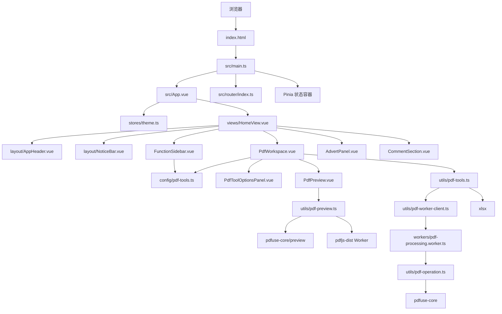

# BaiMeow 项目架构与文件说明

## 1. 总体架构图



## 2. PDF 工具目录

PDF 顶层默认展开，二级分类中只默认展开“常用功能”；页面管理、内容与版式、
信息与导出默认隐藏，点击分类标题后展开。

| 分类 | 工具 | 说明 |
| --- | --- | --- |
| 常用功能 | PDF 合并 | 多文件按队列顺序选择全部页面并合并。 |
| 常用功能 | PDF 拆分 | 输入页码范围，创建只含选中页面的新 PDF。 |
| 常用功能 | 提取页面 | 支持连续或不连续页面提取。 |
| 页面管理 | 删除页面 | 从原页面集合中排除指定页码。 |
| 页面管理 | 旋转页面 | 对指定页面叠加 90、180 或 270 度旋转。 |
| 页面管理 | 页面重排 | 输入包含全部页面的新顺序，防止意外丢页。 |
| 页面管理 | 插入空白页 | 设置插入位置、宽度和高度。 |
| 内容与版式 | 添加页码 | 设置位置、起始数字和字号。 |
| 内容与版式 | 文字水印 | 设置文字、透明度、角度和字号。 |
| 内容与版式 | 页面裁剪 | 设置上、右、下、左裁剪边距。 |
| 信息与导出 | 文档体检 | 查看页数、页面尺寸和元数据。 |
| 信息与导出 | 修改文档信息 | 编辑标题、作者、主题和关键词。 |
| 信息与导出 | 页面导出 PNG | 使用预览模块把当前页导出为 2 倍分辨率图片。 |
| 信息与导出 | 课表转 Excel | 加载本地 CMap、按页面旋转坐标归行并按节次重组后输出 `.xlsx`。 |
| 信息与导出 | 优化保存 | 使用对象流重写 PDF 结构。 |

图片水印仍然只保留菜单入口，没有实现图片处理逻辑。

## 3. `pdfuse-core` 的职责边界

项目使用 `pdfuse-core` 处理 PDF 的加载、页面选择和合并：

```ts
import { loadPdfDocument, mergeSelectedPages } from 'pdfuse-core'
```

`loadPdfDocument` 返回 pdf-lib 的 `PDFDocument`，项目通过这个文档继续执行旋转、
页码、水印、裁剪、插入空白页和元数据修改。这种用法符合 `pdfuse-core` 官方说明中
“高级编辑可以继续使用返回的 `pdfDoc`”这一设计。

缩略图和页面渲染只从独立子路径加载：

```ts
import { renderPageToCanvas } from 'pdfuse-core/preview'
```

页面渲染仍由 `pdfuse-core/preview` 完成；加载包含 CID 字体的文档时，
项目会在同一版本的 `pdfjs-dist` 上补充 `cMapUrl` 和 `standardFontDataUrl`，
再把得到的 PDFDocumentProxy 交给 `renderPageToCanvas`。这样不使用预览功能时
不会提前加载 PDF.js，同时中文 CID 字体也能正确解析。

课表 PDF 使用 `STSong-Light + UniGB-UCS2-H` 这类 CID 字体时，需要额外的
CMap 才能把字符编码转换成 Unicode。项目已将 `pdfjs-dist/cmaps` 和
`standard_fonts` 复制到 `public/pdfjs/`，课表解析时会传入对应的
`cMapUrl` 和 `standardFontDataUrl`。

## 4. Web Worker 数据流

大文件的页面复制、文字绘制和重新保存都可能阻塞主线程。当前实现如下：

1. `PdfWorkspace.vue` 调用 `utils/pdf-tools.ts`；
2. `pdf-tools.ts` 把 `File` 转换为 `ArrayBuffer + 文件元数据`；
3. `pdf-worker-client.ts` 给请求分配递增 id，并通过 Worker 发送；
4. `workers/pdf-processing.worker.ts` 调用统一执行器；
5. `utils/pdf-operation.ts` 使用 `pdfuse-core` 和 pdf-lib 完成处理；
6. Worker 把结果 `ArrayBuffer` 使用 Transferable 返回主线程；
7. 工作台创建 Blob 并触发下载。

如果浏览器不支持 Worker API，`pdf-worker-client.ts` 会动态加载同一个核心执行器
并在主线程中运行，保证功能仍然可用。

预览渲染不使用自定义 Worker，因为 `pdfuse-core/preview` 内部已经使用 PDF.js
自己的 Worker 解析页面，主线程只负责把结果画到 canvas。

## 5. 目录结构

```text
baimeow-v0/
├─ docs/
│  └─ PROJECT_STRUCTURE.md
├─ public/
│  └─ favicon.ico
├─ src/
│  ├─ assets/
│  │  ├─ logo.png
│  │  └─ main.css
│  ├─ components/
│  │  ├─ layout/
│  │  │  ├─ AppHeader.vue
│  │  │  └─ NoticeBar.vue
│  │  ├─ settings/
│  │  │  └─ ThemeSettingsDrawer.vue
│  │  └─ workspace/
│  │     ├─ FunctionSidebar.vue
│  │     ├─ PdfWorkspace.vue
│  │     ├─ PdfToolOptionsPanel.vue
│  │     ├─ PdfPreview.vue
│  │     ├─ AdvertPanel.vue
│  │     └─ CommentSection.vue
│  ├─ config/
│  │  └─ pdf-tools.ts
│  ├─ router/
│  │  └─ index.ts
│  ├─ stores/
│  │  └─ theme.ts
│  ├─ types/
│  │  ├─ pdf.ts
│  │  └─ pdf-worker.ts
│  ├─ utils/
│  │  ├─ pdf-tools.ts
│  │  ├─ pdf-operation.ts
│  │  ├─ pdf-preview.ts
│  │  └─ pdf-worker-client.ts
│  ├─ views/
│  │  └─ HomeView.vue
│  ├─ workers/
│  │  └─ pdf-processing.worker.ts
│  ├─ App.vue
│  └─ main.ts
├─ index.html
├─ package.json
├─ package-lock.json
├─ vite.config.ts
└─ tsconfig*.json
```

## 6. 关键文件说明

| 文件 | 用途 |
| --- | --- |
| `config/pdf-tools.ts` | 十五个工具的标题、图标、分类和参数默认值。 |
| `components/workspace/FunctionSidebar.vue` | 三级菜单，PDF 展开且仅“常用功能”默认展开。 |
| `components/workspace/PdfWorkspace.vue` | 文件队列、参数、进度和结果展示。 |
| `components/workspace/PdfToolOptionsPanel.vue` | 每种工具对应的参数表单。 |
| `components/workspace/PdfPreview.vue` | 缩略图、当前页预览和翻页。 |
| `components/workspace/PdfEffectPreview.vue` | 每个工具共用的处理前、处理后效果对照。 |
| `utils/pdf-operation.ts` | 可同时运行在主线程和 Worker 的核心 PDF 操作。 |
| `workers/pdf-processing.worker.ts` | Worker 消息入口和 Transferable 返回。 |
| `utils/pdf-worker-client.ts` | Worker 单例、请求 id 和 Promise 管理。 |
| `utils/pdf-preview.ts` | 统一配置 `pdfuse-core/preview` 与 PDF.js Worker。 |
| `utils/pdf-tools.ts` | 对工作台暴露的业务函数和统一工具入口。 |
| `types/pdf.ts` | PDF 工具、文件和结果类型。 |
| `types/pdf-worker.ts` | 主线程与 Worker 的消息协议。 |

## 7. Logo 放置位置

推荐替换：

```text
src/assets/logo.png
```

`AppHeader.vue` 已经通过 Vite 导入该文件，保持文件名不变即可。建议使用正方形图片，
尺寸为 512 × 512 或 1024 × 1024，并尽量将文件控制在 200 KB 左右。

如果改放到 `public/logo.png`，需要把 `AppHeader.vue` 中的导入改为固定路径 `/logo.png`。
当前项目推荐继续使用 `src/assets/logo.png`。

## 8. 三种主题

主题变量集中在 `src/assets/main.css`：

| `data-theme` | 主题 |
| --- | --- |
| `plain` | 简约朴素风，默认值 |
| `fresh` | 小清新风 |
| `tech` | 未来科技风 |

组件只使用 `var(--bm-*)`，切换主题不会重建页面结构。

## 9. 验证方式

开发完成后执行：

```bash
npm run type-check
npm run build
npx eslint . --no-fix
npx oxlint .
```

浏览器验证应至少覆盖：

- 桌面端和 375px 手机端无横向溢出；
- 上传 PDF 后能显示页数、缩略图和当前页；
- 每个 PDF 工具可以生成对应结果；
- Worker 控制台没有版本或序列化错误；
- 拆分、合并、PNG 和 Excel 文件可以正常下载。
