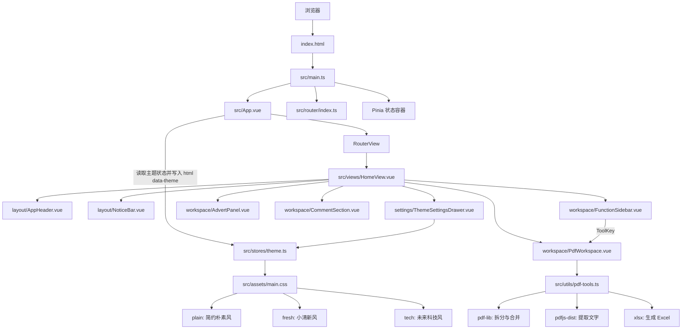

# BaiMeow 项目架构与文件说明

## 1. 总体架构图



## 2. 数据流说明

### 主题切换

1. 用户点击右上角设置按钮。
2. `ThemeSettingsDrawer.vue` 调用 `themeStore.setTheme()`。
3. Pinia 更新主题并把结果写入 `localStorage`。
4. `App.vue` 监听到主题变化，将值写到 `<html data-theme="plain|fresh|tech">`。
5. `src/assets/main.css` 根据属性切换 CSS 变量，所有组件立即更新颜色。

### PDF 处理

1. 用户拖拽或选择 PDF 文件。
2. `PdfWorkspace.vue` 把文件转换成 `PdfFileItem[]`。
3. `src/utils/pdf-tools.ts` 根据当前工具调用拆分、合并或课表转换函数。
4. 大体积依赖按操作动态加载，不使用某项功能时不会提前下载。
5. 处理结果以 `Blob` 保存在内存中，用户点击下载后才由浏览器写入本地文件。

### 留言

当前版本没有后端，`CommentSection.vue` 使用 `localStorage` 保存留言。以后接入接口时，只需要替换读取、提交和持久化三个函数，不需要修改页面结构。

## 3. 目录结构

```text
baimeow-v0/
├─ docs/
│  └─ PROJECT_STRUCTURE.md       项目架构、数据流和文件用途
├─ public/
│  └─ favicon.ico                浏览器标签页图标
├─ src/
│  ├─ assets/
│  │  ├─ logo.png                网站 Logo
│  │  └─ main.css                全局重置、三种主题变量和 Element Plus 映射
│  ├─ components/
│  │  ├─ layout/
│  │  │  ├─ AppHeader.vue         Logo、网站名和设置按钮
│  │  │  └─ NoticeBar.vue         细滚动公告
│  │  ├─ settings/
│  │  │  └─ ThemeSettingsDrawer.vue  主题设置抽屉
│  │  └─ workspace/
│  │     ├─ FunctionSidebar.vue   左侧可折叠功能菜单
│  │     ├─ PdfWorkspace.vue      拖拽、文件队列和处理结果
│  │     ├─ AdvertPanel.vue       右侧广告与用户投稿占位
│  │     └─ CommentSection.vue    留言输入和留言列表
│  ├─ router/
│  │  └─ index.ts                 页面路由配置
│  ├─ stores/
│  │  └─ theme.ts                 当前主题与本地持久化
│  ├─ types/
│  │  └─ pdf.ts                   PDF 文件和工具共享类型
│  ├─ utils/
│  │  └─ pdf-tools.ts             PDF 拆分、合并、文字提取和 Excel 导出
│  ├─ views/
│  │  └─ HomeView.vue             首页组件组合与响应式三栏布局
│  ├─ App.vue                     根组件与主题同步
│  └─ main.ts                     Vue、Pinia、Router、Element Plus 入口
├─ auto-imports.d.ts             unplugin-auto-import 自动生成类型
├─ components.d.ts               unplugin-vue-components 自动生成类型
├─ env.d.ts                      Vite 环境类型
├─ eslint.config.ts              ESLint 配置
├─ index.html                    HTML 模板、页面标题和 Meta 信息
├─ package.json                  依赖与脚本
├─ package-lock.json             依赖锁定文件
├─ tsconfig*.json                TypeScript 分层配置
└─ vite.config.ts                Vite、Vue、自动导入和路径别名配置
```

## 4. 文件用途

| 文件 | 用途 |
| --- | --- |
| `index.html` | 浏览器首先加载的 HTML，包含挂载节点、页面标题和描述。 |
| `src/main.ts` | 创建 Vue 应用并注册 Pinia、路由和 Element Plus。 |
| `src/App.vue` | 根组件，只负责主题同步和渲染当前路由页面。 |
| `src/router/index.ts` | 把 `/` 映射到 `HomeView.vue`，方便以后扩展新页面。 |
| `src/views/HomeView.vue` | 组合页头、公告、侧栏、工作台、广告和评论区。 |
| `src/components/layout/AppHeader.vue` | Logo、BaiMeow 网站名和设置按钮。 |
| `src/components/layout/NoticeBar.vue` | 高度较细的无限滚动公告。 |
| `src/components/workspace/FunctionSidebar.vue` | PDF 与图片分组菜单，PDF 默认展开。 |
| `src/components/workspace/PdfWorkspace.vue` | 文件拖拽、列表排序、参数输入、进度、结果下载。 |
| `src/components/workspace/AdvertPanel.vue` | 用户投稿广告区和站内推荐占位。 |
| `src/components/workspace/CommentSection.vue` | 本地留言提交、校验、时间格式化与展示。 |
| `src/components/settings/ThemeSettingsDrawer.vue` | 三种主题选择面板。 |
| `src/stores/theme.ts` | 默认主题、主题校验和 `localStorage` 持久化。 |
| `src/types/pdf.ts` | 避免 PDF 工具和组件之间重复定义对象结构。 |
| `src/utils/pdf-tools.ts` | 所有 PDF 文件处理逻辑，与 Vue 页面解耦。 |
| `src/assets/main.css` | 全局样式、响应式基础、三种主题和 Element Plus 变量。 |
| `src/assets/logo.png` | 当前网站 Logo。 |
| `public/favicon.ico` | 浏览器标签页图标。 |

## 5. Logo 放置说明

推荐继续使用 Vite 管理的资源目录：

```text
src/assets/logo.png
```

原因是 `AppHeader.vue` 已经通过 `import logoUrl from '@/assets/logo.png'` 引入它。构建时 Vite 会自动处理路径和缓存版本，替换同名文件即可，不需要修改模板。

另一种方式是放在：

```text
public/logo.png
```

`public` 中的文件不会参与构建哈希，访问路径固定为 `/logo.png`。如果改放这里，需要把
`AppHeader.vue` 中的导入改成字符串路径 `/logo.png`。

对于当前项目，建议使用 `src/assets/logo.png`。推荐图片规格：

- 正方形或接近正方形；
- 512 × 512 或 1024 × 1024；
- PNG 背景透明或使用纯色背景；
- 文件尽量小于 200 KB，避免拖慢首屏。

## 6. 三种主题

主题变量集中定义在 `src/assets/main.css`：

| `data-theme` | 主题名称 | 主要特征 |
| --- | --- | --- |
| `plain` | 简约朴素风 | 低饱和绿色、暖色点缀，默认主题。 |
| `fresh` | 小清新风 | 明亮薄荷绿与柔和粉色。 |
| `tech` | 未来科技风 | 近黑背景、青色主色与蓝紫高光。 |

组件不应该写死颜色，而应使用 `var(--bm-*)`。这样增加第四种主题时，只需要增加一组变量，不需要逐个修改页面组件。

## 7. 已清理的脚手架文件

以下默认演示文件没有参与当前业务，已删除：

- `AboutView.vue`
- `stores/counter.ts`
- `HelloWorld.vue`
- `TheWelcome.vue`
- `WelcomeItem.vue`
- `components/icons/` 下的 Vue 默认图标组件
- 旧的 `assets/base.css`

保留的配置文件均是开发、构建、格式化或类型检查所需文件。
